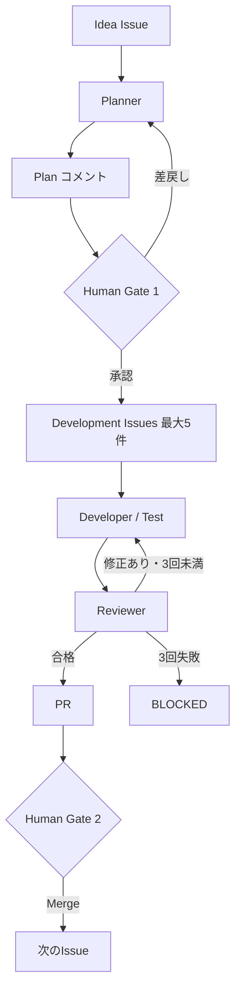
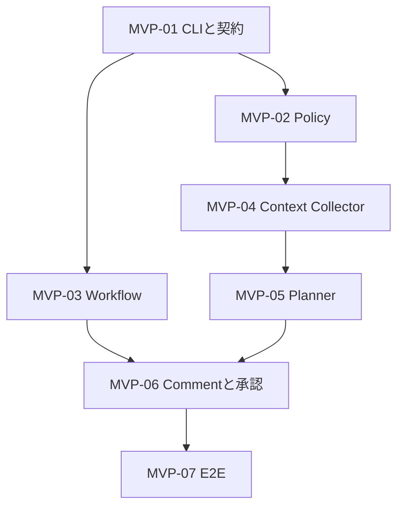

# Agentic Development Harness 設計方針書

## 1. この文書の目的

本書は `agentic-dev-harness` の責務、境界、最初の MVP、開発順を定めるための Phase 0 設計です。

詳細なクラス設計、永続化方式、特定 Coding Agent の細かな呼び出し方は、実装時に必要になってから決めます。

## 2. 解決したいこと

既存 Repository に Idea Issue を登録した後、人間が毎回 Repository の説明、実装計画、作業分割、Coding Agent への指示を手作業でつなぐ負担を減らします。

Harness は次を一貫して管理します。

- Idea と実行状態の対応
- Planner が読む Repository Context の範囲
- 人間の承認待ち
- Development Issue の順次実行
- テスト、レビュー、修正回数
- PR 作成と BLOCKED への Escalation

## 3. スコープ

### 対象

- GitHub Issue を入口とするオーケストレーション
- GitHub Actions 上での実行
- Codex や Claude Code など既存 Coding Agent の呼び出し
- Planner、Developer、Reviewer 間の Context 引き継ぎ
- Human Gate、Retry、BLOCKED、PR の状態管理
- 対象 Repository に置く薄い Workflow と Policy の契約

### 初期スコープ外

- Coding Agent または基盤モデルそのものの開発
- 独自 Web UI
- SaaS 化、課金、複数組織向けテナント管理
- 汎用的で複雑な Multi-Agent Framework
- 自動 Merge
- Repository 全体を毎回読み込む仕組み
- Phase 0 における Developer、Reviewer、Retry の実装

## 4. Repository 境界

### Harness Repository

`agentic-dev-harness` に判断と制御を集約します。

- Planner / Developer / Reviewer の実行制御
- Context 収集
- Plan 形式と検証
- GitHub Issue / Comment / PR の状態遷移
- Retry と Escalation
- 対象 Repository 用 Integration のテンプレート

### 対象 Repository

対象側は次の薄い Integration のみを持ちます。

- `.github/workflows/agent.yml`: Harness を呼び出す入口
- `.agent/policy.yaml`: Repository 固有の許可範囲と Context 起点

最初の対象は `home-dns-observability` ですが、Phase 0 では変更しません。

## 5. 全体フローと状態



初期実装では、Harness 専用データベースを前提にしません。まず GitHub の Issue、Comment、Label、Workflow run を状態の記録先として使い、足りないことが確認された場合だけ永続化方式を追加検討します。

## 6. 承認と自律実行の境界

| 操作 | 初期方針 |
|---|---|
| Plan の採用 | Human Gate 1 が必要 |
| Development Issue 生成 | Plan 承認後、最大5件 |
| 既存アーキテクチャ内の変更 | 自律実行可能 |
| ライブラリ追加 | 自律実行可能 |
| アーキテクチャ変更 | 人間の追加承認が必要 |
| Review 指摘の修正 | 最大3回まで自律実行 |
| 3回失敗後 | `BLOCKED` として Escalation |
| PR 作成 | 自律実行可能 |
| Merge | 人間のみ |

「アーキテクチャ変更」の厳密な自動判定は初期から一般化しません。Planner が該当可能性と根拠を Plan に明記し、Policy で承認対象として扱うところから始めます。

## 7. Planner の Repository 理解

### 7.1 固定 Context

Planner は、対象 Repository の Policy で明示された少数の入口を必ず確認します。初期既定値は次の候補です。

- `README.md`
- `AGENTS.md`（存在する場合）
- `docs/PROJECT.md` または Policy が指定する同等文書
- 主要な依存関係・実行方法が分かる Manifest

存在しないファイルをエラーにはせず、確認結果に「不存在」として残します。

### 7.2 Idea 依存の限定探索

固定 Context と Idea の語句から、関連するディレクトリ、コード、テスト、設定を段階的に探索します。

初期ルールは次の通りです。

- 最初から Repository 全体を本文として Agent に渡さない
- ファイル一覧や検索結果から関連候補を絞る
- 探索上限を Policy で設定できるようにする
- 上限で十分な根拠が得られない場合は、推測で Plan を確定せず人間へ質問する
- Secret、生成物、巨大ファイル、除外指定を Context に含めない

### 7.3 Context Manifest

Plan には少なくとも次を付けます。

- 確認したファイルまたは範囲
- 各 Context を選んだ理由
- 確認できなかった情報
- Plan の前提と不確実性

これにより、人間は Planner が何を根拠に Plan を作ったか確認でき、Developer は同じ Context を起点にできます。

Reviewer はこの Manifest だけに拘束されず、変更差分から独立して影響範囲を確認します。

## 8. MVP

### 8.1 完成条件

以下を `home-dns-observability` の本物の Idea Issue で確認できることを最初の MVP 完成条件とします。

1. Idea Issue から対象 Repository の Workflow を起動できる
2. Workflow が `agentic-dev-harness` の Planner を実行できる
3. Planner が固定 Context と限定探索で Plan を生成できる
4. Plan に Context Manifest と選定理由が含まれる
5. Plan が元 Idea Issue のコメントとして投稿される
6. 人間が Plan を承認できる
7. 承認済み状態を Harness が識別できる

MVP 完了時点では、Development Issue の自動生成や実装開始は行いません。

### 8.2 dogfooding 成功条件

MVP の次段階で Developer / Reviewer ループを追加し、`home-dns-observability` の未実装 Idea から実際の PR を1本作成できた時点を、最初の dogfooding 成功とします。Merge は人間が行います。

## 9. 最小構成

Phase 0 では文書だけを配置します。

```text
agentic-dev-harness/
├── README.md
└── docs/
    └── DESIGN.md
```

実装時は必要になった順に次を追加します。

```text
src/          Harness 本体
tests/        単体・契約テスト
templates/    対象 Repository 用 Workflow / Policy
```

パッケージ構造や Agent ごとのディレクトリ分割は、最初の実装で責務が確認できてから決めます。

## 10. 実装時に確定する最小の技術判断

最初の Issue で、以下だけを確定します。

- GitHub Actions から呼べる CLI の入口
- Harness と対象 Workflow 間の入力・出力
- テストと Lint の最小構成
- Coding Agent 実行方法を差し替えられる最小境界

特定 Agent SDK、独自キュー、データベース、プラグイン機構は、必要性が実証されるまで導入しません。

### MVP-01 で確定したこと

- Python 3.12 以上、`src/` 配置、標準ライブラリの `argparse` による CLI。
- `agentic-dev-harness plan` が Repository、Issue 番号、Policy パスを受け取り JSON を返す。
- `Planner.plan(request) -> PlannerResult` を差し替え境界とし、現時点は DummyPlanner のみ。
- pytest と Ruff を PR / main push の CI で実行する。
- 入出力・終了コードの詳細は [README](../README.md#入出力契約mvp-01) に集約する。
- Policy の読み込みは MVP-02、実 Plan の Schema と Agent 接続は MVP-05 で扱う。

## 11. Phase 0 Backlog

以下の7件を GitHub Issue として作成します。番号は作成後の GitHub Issue 番号に置き換わるため、ここでは `MVP-01` から `MVP-07` を安定した識別子として使います。

### MVP-01 Harness CLI の最小骨格と実行契約を定義する

**目的**  
GitHub Actions から Harness を一貫して呼び出せる最小の入口を作る。

**対象**

- 実装言語と最小パッケージ構成の確定
- Planner コマンドの仮入口
- Repository、Issue 番号、Policy パスなど必要最小限の入力契約
- テスト・Lint の実行方法
- Agent 実装を固定しすぎない薄い呼び出し境界

**完了条件**

- ダミー入力で CLI が起動し、構造化した結果を返す
- 単体テストと Lint が CI で成功する
- README にローカル実行方法が追加される

**依存** なし

### MVP-02 `.agent/policy.yaml` の最小仕様と Loader を作る

**目的**  
対象 Repository 固有の Context 起点、探索上限、除外範囲を Harness が受け取れるようにする。

**対象**

- Policy の最小 Schema
- 既定値と入力検証
- `home-dns-observability` 用サンプル（Harness Repository 内のテンプレートのみ）

**完了条件**

- 正常な Policy を読み込める
- 不正な Policy を安全に拒否できる
- Secret・生成物・巨大ファイルを除外できる最小設定がある

**依存** MVP-01

### MVP-03 対象 Repository 用の薄い Workflow 契約を作る

**目的**  
Idea Issue から Harness の Planner を起動する Integration をテンプレート化する。

**対象**

- `templates/.github/workflows/agent.yml`
- 起動条件と必要権限
- Harness の固定バージョンを呼ぶ契約
- 同じイベントの重複実行を避ける最小制御

**完了条件**

- テンプレートの構文と必要権限をテストできる
- Idea Issue と通常 Issue を区別する条件が文書化される
- この Issue では `home-dns-observability` へ配置しない

**依存** MVP-01

### MVP-04 固定 Context と限定探索の Collector を実装する

**目的**  
Repository 全体を無制限に渡さず、Idea に必要な Context を収集する。

**対象**

- 固定 Context の確認
- Idea の語句を起点とした段階的検索
- Policy による上限・除外
- Context Manifest の生成

**完了条件**

- 読み込んだ範囲と選定理由が Manifest に残る
- 上限到達と情報不足を区別できる
- Fixture Repository に対し、無関係なファイルを大量に渡さないことをテストできる

**依存** MVP-02

### MVP-05 Planner 実行と Plan 形式を実装する

**目的**  
Idea と Context Manifest から、人間が承認判断できる Plan を生成する。

**Plan の最小項目**

- Idea の理解
- 変更方針と対象候補
- 最大5件の Development Issue 案
- テスト方針
- Context Manifest と選定理由
- 前提、不確実性、人間への確認事項
- アーキテクチャ変更の可能性

**完了条件**

- 構造化 Plan を生成し、表示用 Markdown に変換できる
- Development Issue 案が5件を超えた場合は失敗する
- Context 不足時は実装可能と装わず確認事項を返す

**依存** MVP-04

### MVP-06 Plan コメント投稿と Human Gate 1 を実装する

**目的**  
Plan を元 Idea Issue に投稿し、人間の承認状態を Harness が識別できるようにする。

**対象**

- Plan コメントの作成または安全な更新
- 承認方法の最小仕様
- Idea、実行、Plan コメントの対応付け
- 再実行時の二重投稿防止

**完了条件**

- Plan が元 Idea Issue に1つの管理対象コメントとして投稿される
- 承認前後の状態を判定できる
- 未承認のまま次工程へ進まない
- 同一実行を再送してもコメントが無制限に増えない

**依存** MVP-03、MVP-05

### MVP-07 `home-dns-observability` で Planner ループを E2E 検証する

**目的**  
最初の MVP を本物の対象 Repository と Idea Issue で成立させる。

**対象**

- 合意後に対象 Repository へ薄い Workflow と Policy を配置
- 未実装 Idea を1件選定
- Plan コメント投稿と人間承認まで実行
- 実行ログと発見事項を記録

**完了条件**

- MVP 完成条件7項目を実環境で確認できる
- `home-dns-observability` の既存監視・Reporting 実行に影響を与えない
- 次段階の Developer / Reviewer 実装に必要な不足が Issue 化される

**依存** MVP-06

## 12. 依存関係と推奨実装順



推奨順は `MVP-01 → MVP-02 → MVP-04 → MVP-05 → MVP-03 → MVP-06 → MVP-07` です。

`MVP-03` は `MVP-02` から独立して進められますが、最初は Harness 本体の入出力を固めてから Workflow を作る方が手戻りを抑えられます。

## 13. Phase 0 の完了条件

- 独立した `agentic-dev-harness` Repository がある
- README と本設計方針書がある
- 初期ディレクトリが必要最小限である
- MVP 作業が5〜7件の Issue に分割されている
- 依存関係と推奨順が明示されている
- `home-dns-observability` は変更されていない

## 14. Phase 0 で意図的に未確定とすること

- Planner に使う Coding Agent の最終選択と切替方式
- Human Gate 1 の具体的な GitHub 操作（Label、Reaction、Command など）
- Harness の配布方法（Reusable Workflow、Action、CLI パッケージのどれを主にするか）
- GitHub App が必要になる時点と権限設計
- Developer / Reviewer の Branch、Commit、PR 戦略の詳細
- Architecture change 判定の精度向上方法

これらは MVP-01 から MVP-06 の中で、実際の制約が見えた時点で最小限だけ確定します。
